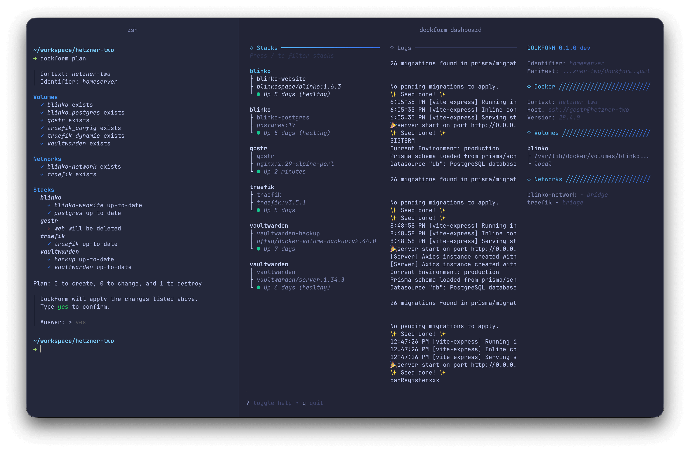

# What is Dockform?

Dockform extends Docker Compose with a fully declarative workflow.  
It lets you manage not only your Compose stacks, but also the supporting resources that normally sit outside of `docker-compose.yml` — such as external networks, volume lifecycles, secrets, and configuration files.

Think of Dockform as the missing declarative layer for everything you'd otherwise configure manually with commands like `docker network create`, `docker volume create`, or ad-hoc shell scripts. All of it is written as code, stored in a manifest, and applied consistently.

[](preview.png)

## What's New in v0.9

Dockform now does helps keeping images up to date: tells you what's out of date, pulls what you want to keep floating, and rewrites tags in your compose files so you can review the change like any other commit.

- **Image management commands**: `dockform images check`, `pull`, and `upgrade` report freshness, pull digest-drifted images, and rewrite outdated tags in your compose files
- **Per-service tag policy**: set `dockform.tag_pattern` as a compose label on each service to control which tags count as upgrades
- **UI/UX improvements**

See the [Image Management](../more/images.md) guide for the full workflow.

## What's New in v0.8

- **Multi-context support**: Deploy to multiple Docker daemons from a single manifest
- **Automatic discovery**: Stacks and filesets are found from your directory structure
- **Simplified schema**: Less boilerplate, more convention-over-configuration
- **Context-scoped resources**: Volumes and networks are defined per context

## Use Cases

Dockform is designed for simple, reproducible deployments where heavy orchestration tools would be overkill:

- **Single-server deployments** – Manage apps and infrastructure in one manifest file  
- **Multi-server setups** – Deploy to local, staging, and production from one config
- **Homelabs** – Codify personal stacks, keep them reproducible and shareable  
- **Small teams** – Bring predictability and consistency to Docker-based workflows  
- **Learning & prototyping** – Experiment with declarative infrastructure without added complexity  

## Why Dockform?

- **Declarative by design** – Describe your stack once, apply it anywhere  
- **Multi-context** – Deploy to local Docker, remote servers, or multiple environments
- **Auto-discovery** – Stacks are found from your directory structure automatically
- **Git-friendly** – Version-control both apps and infrastructure resources together  
- **Lightweight** – No extra daemons, clusters, or databases required  
- **Seamless with Compose** – Works with existing Compose files without replacing them  
- **Safe & consistent** – Avoid manual drift by codifying everything in a single manifest  

## Multi-Context Example

Deploy the same application to development and production:

```yaml
identifier: myapp

contexts:
  local: {}        # Local Docker daemon
  production: {}   # Remote server via SSH

stacks:
  local/web:
    profiles: [debug]
  production/web:
    profiles: [production]
```

```
my-project/
├── dockform.yml
├── local/
│   └── web/
│       └── compose.yaml
└── production/
    └── web/
        └── compose.yaml
```

```bash
# Deploy to local
dockform apply --context local

# Deploy to production
dockform apply --context production

# Deploy everything
dockform apply
```
