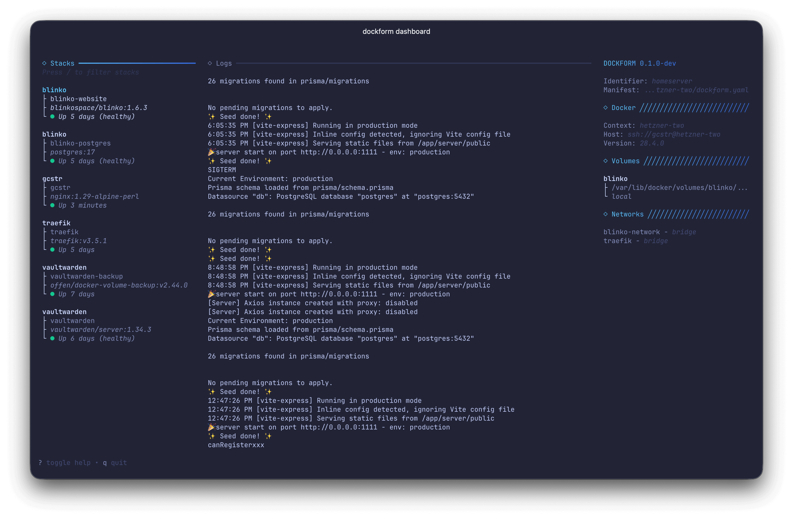
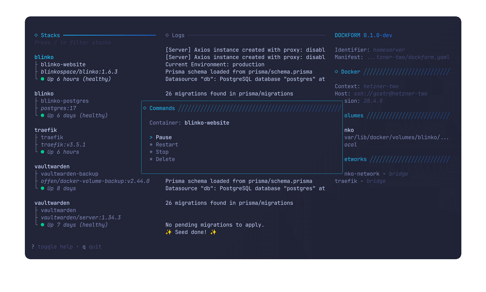

# Dashboard

Dockform includes a fullscreen terminal dashboard that gives you a live, at‑a‑glance view of your stacks, containers, and logs.

## Launching

- Basic: `dockform dashboard`
- With a specific manifest: `dockform dashboard --config path/to/dockform.yaml`

The dashboard uses your manifest to discover stacks and services, and your Docker context to query runtime state. If `--config` is omitted, Dockform resolves the manifest path from the current working directory or your configured base directory.

## Layout

The UI is split into three columns:

- Stacks (left)
    - One entry per service across all manifest stacks
    - Shows service name or resolved container name, image, and a one‑line status
    - Filterable by stack name, service, container name, or image
- Logs (center)
    - Live stream of the selected container’s logs
    - Auto‑scrolls to the newest lines; supports scrolling back
- Info (right)
    - Dockform: version, identifier, manifest path
    - Docker: context name, host endpoint, engine version
    - Volumes: volumes attached to the selected service/container
    - Networks: networks attached to the selected service/container

Headers highlight the active pane with a subtle gradient. Colors are tuned for a dark terminal theme.

## Keyboard Shortcuts

| Shortcut                | Action                                               |
|-------------------------|------------------------------------------------------|
| `?`                     | Toggle help                                          |
| `q` or `Ctrl+C`         | Quit                                                 |
| `/`                     | Filter stacks                                        |
| `↑/k`, `↓/j`            | Move selection                                       |
| `→/l/pgdn`, `←/h/pgup`  | Next/previous page                                   |
| `Tab`                   | Cycle pane (Stacks ↔ Logs)                           |
| `Enter`                 | Focus logs (from Stacks)                             |
| `Ctrl+P`                | Open command palette (Pause/Restart/Stop/Delete selected container) |

When filtering, type to search across stack, service, container, and image fields. Press `Esc` to leave filter mode.

## Command Palette

Press `Ctrl+P` to open a floating command palette centered over the dashboard. The palette shows the currently selected container and offers the following operations:

:lucide-pause: Pause — runs `docker container pause` for the container  
:lucide-rotate-ccw: Restart — runs `docker container restart`  
:lucide-octagon-x: Stop — runs `docker container stop`  
:lucide-trash-2: Delete — force removes the container with `docker container rm -f`  

Use j/k or the arrow keys to highlight a command, `Enter` to execute it, and `Esc` to close the palette without acting. If no container is selected, the palette indicates it and actions are disabled. After a command runs, the regular status polling and logs stream reflect the new container state automatically.

## What You See

- Status bullets per service
    - Green: running (healthy or no healthcheck issues detected)
    - Yellow: starting, created, or restarting
    - Red: exited/unhealthy/other error states
    - The rightmost line shows Docker’s status string (for example, “Up 2m (healthy)”).
- Resolved container names
    - If a service has an explicit `container_name`, it’s shown and used for log streaming
    - Otherwise Dockform locates the container by labels: `io.dockform.identifier` + `com.docker.compose.service`
- Volumes and networks
    - The right column lists all volumes and networks in the Docker context and highlights only those attached to the selected service/container
    - Volume entries show name, mountpoint, and driver; networks show name and driver

## Interaction Model

- Selecting an item in Stacks automatically starts tailing that container’s logs in the center pane (with a small debounce to avoid rapid restarts while navigating)
- Press `Enter` to bring focus to the Logs pane; use the same navigation keys to scroll
- Press `Tab` to toggle focus between Stacks and Logs
- Command palette actions operate on the currently selected container; once Docker finishes the operation, statuses and attachments refresh on the next poll

## Data Flow and Sources

Under the hood, the dashboard combines static data from Compose with live information from Docker:

- Stack and service discovery
    - The loader reads your manifest, resolves each stack’s working directory, and calls `docker compose config` to build a merged view of services, images, networks, and volumes
    - Services are shown per stack, sorted alphabetically
- Live status polling
    - Every 2 seconds, the dashboard queries `docker ps` (including stopped containers) filtered by `io.dockform.identifier` when set
    - For each service, it prefers an explicit `container_name`; otherwise it matches by `com.docker.compose.service`
    - Status color is selected from the container state plus health hints in Docker’s status text
- Logs streaming
    - When a service/container is selected, `docker logs --follow --tail=300` streams into the Logs pane
    - Switching selection cancels the prior stream and starts a new one
- Volumes and networks
    - The dashboard lists volumes (name, driver, mountpoint) and networks (name, driver) from the Docker context
    - Attachments are inferred from Compose service definitions and mapped to either `container_name` or service name
- Docker context info
    - Host endpoint and engine version come from `docker version` for the active context

!!! Note
    - If Docker is unreachable, Docker info shows “(unknown)” and live status/logs may be empty
    - Stacks with no services appear as “(no services)” with an empty status
    - Volumes/networks are shown from the context; only attachments for the selected entry are highlighted
